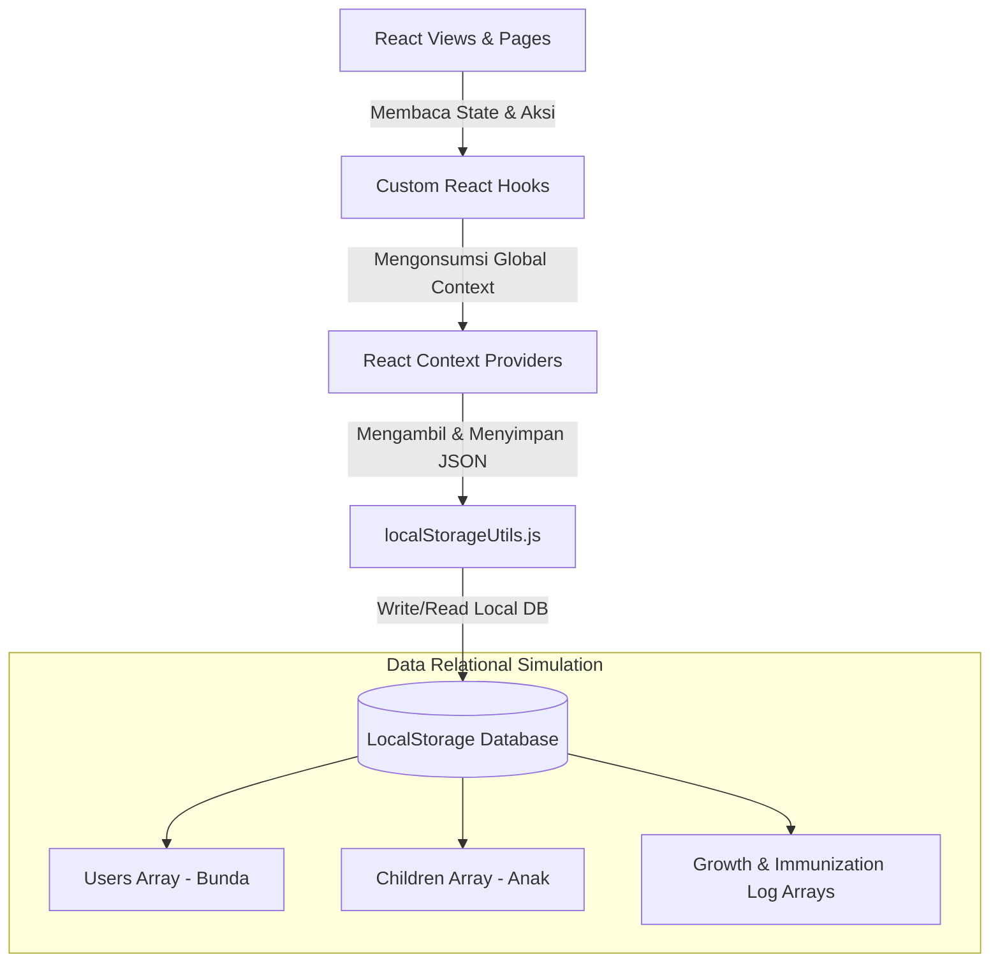

# 👶 Hayya — Teman Digital Bunda 🧡

**Hayya** adalah aplikasi web (*SaaS mobile-first*) inovatif yang dirancang khusus untuk mendampingi Bunda dalam memantau tumbuh kembang buah hati secara mandiri. Aplikasi ini mengutamakan privasi dengan prinsip *offline-first* dan data lokal yang aman di dalam perangkat HP Bunda.

Aplikasi ini dibangun berdasarkan panduan spesifikasi **PRD Bab 5 (Panduan Desain UI/UX)** dan standardisasi WHO dalam evaluasi pertumbuhan anak.

---

## ✨ Fitur Unggulan

1. **Multi-Account & Child Switcher**: Sistem profil cerdas yang memungkinkan Bunda mendaftarkan beberapa anak sekaligus dan berpindah profil anak aktif secara instan dengan transisi visual yang halus.
2. **Premium Custom React DatePicker**: Pengganti penanggalan native browser yang ciamik, identik di semua platform, dilengkapi dengan *smart viewport-aware positioning* (otomatis mendeteksi ruang layar atas/bawah) dan dekluterisasi tata letak minimalis tanpa bingkai ganda.
3. **Pencatatan Pertumbuhan Terstandar WHO**:
   * Evaluasi Kurva Pertumbuhan WHO (Z-score ±2) untuk Berat Badan, Tinggi Badan, Lingkar Kepala, dan LiLA (Lengan).
   * Visualisasi grafik tren pertumbuhan interaktif berbasis SVG murni.
4. **Kalender Imunisasi Mandiri**: Rekomendasi jadwal vaksinasi anak dari lahir hingga usia 2 tahun berdasarkan anjuran IDAI, lengkap dengan pencatatan log petugas medis, lokasi, dan KIPI (efek samping).
5. **Panduan Resep & MPASI**: Panduan nutrisi sehat terstruktur sesuai umur si kecil.

---

## 🏛️ Arsitektur Aplikasi & Struktur Proyek

Hayya dibangun dengan ekosistem **React 19** + **Vite 8** + **Tailwind CSS v4** dengan pembagian arsitektur kode yang modular dan *highly maintainable*:

```text
hayya/
├── dist/                  # Hasil kompilasi build produksi Vite
├── public/                # Aset statis aplikasi
├── src/
│   ├── assets/            # Ikon, logo, dan aset gambar visual
│   ├── components/        # Komponen UI global (CustomDatePicker, Layout, dsb)
│   ├── context/           # State Management global (Auth, Child, Immunization Context)
│   ├── hooks/             # Custom React Hooks (useAuth, useChild, useGrowth, useImmunization)
│   ├── pages/             # Alur entry-point halaman utama (Login, Register, Profil)
│   ├── utils/             # Helper fungsi (kalkulasi usia, penformatan tanggal, localStorage database)
│   ├── views/             # Komponen presentasi sub-fitur di dalam Dashboard
│   ├── App.jsx            # Registrasi routing dan inisialisasi context
│   ├── index.css          # Desain sistem global, Tailwind v4 @theme, & gaya kustom form
│   └── main.jsx           # Entry-point bootstrap aplikasi React
├── package.json           # Dependensi dependensi proyek
└── README.md              # Dokumentasi proyek (Dokumen ini)
```

---

## 🔄 Aliran Aliran Data (Data Pipeline Flow)

Hayya mensimulasikan penyimpanan database relasional lokal dengan komitmen data tunggal berbasis JSON di dalam `localStorage` (kunci `hayya_app_data`). Berikut diagram arsitektur aliran data di dalam Hayya:



### Penjelasan Aliran Data:
1. **Penyimpanan Tunggal**: Semua data (User, Anak, Riwayat Tumbuh Kembang, Imunisasi) disimpan dalam satu objek datar relasional di `localStorage` melalui utilitas `localStorageUtils.js`.
2. **React Context**: Berperan sebagai jembatan *reactive state management*. Ketika Bunda mengubah anak aktif atau menambah catatan baru, context akan melakukan sinkronisasi ulang dan memicu render ulang yang reaktif.
3. **Custom Hooks**: Menyediakan API bersih untuk dikonsumsi oleh komponen *Views* dan *Pages* tanpa perlu mengelola *state logic* yang rumit secara langsung di dalam elemen antarmuka.

---

## 🛠️ Panduan Menjalankan Proyek Secara Lokal

Pastikan Node.js (minimum v18+) sudah terinstal di komputer Bunda, lalu jalankan langkah berikut:

### 1. Instal Dependensi Proyek
```bash
npm install
```

### 2. Jalankan Mode Pengembangan (Local Dev Server)
```bash
npm run dev
```
Buka peramban (browser) di tautan `http://localhost:5173`.

### 3. Kompilasi untuk Produksi (Vite Build)
```bash
npm run build
```
Hasil build produksi yang dioptimalkan akan tersimpan bersih di dalam direktori `/dist`.

---

🧡 *Dibuat dengan penuh dedikasi untuk memudahkan perjalanan tumbuh kembang generasi masa depan yang cerah.*
